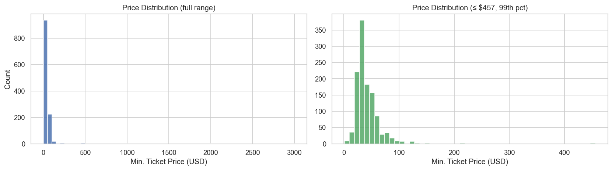
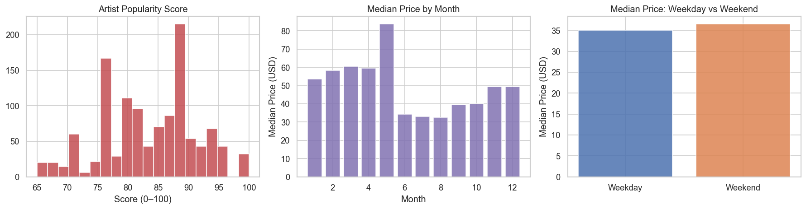
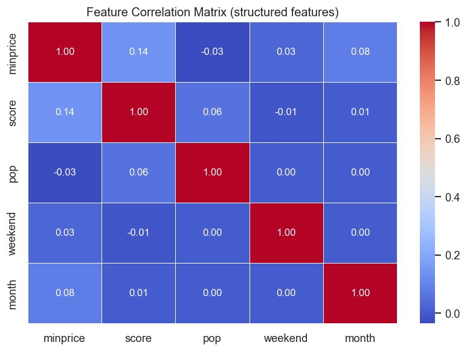
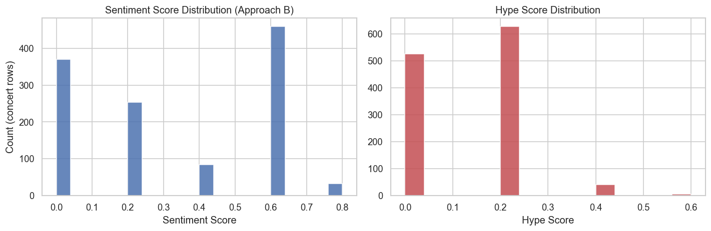
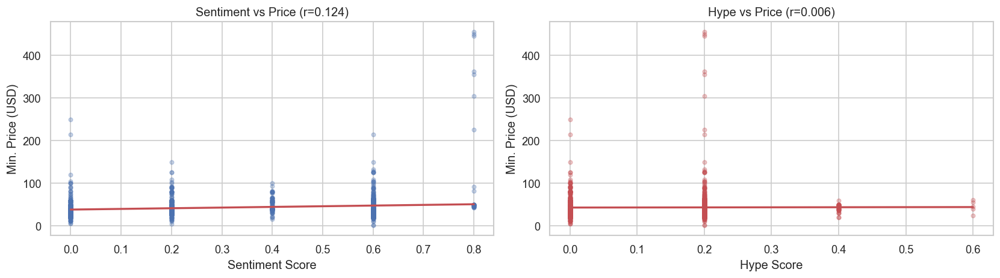
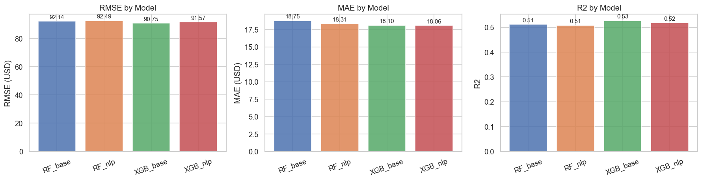
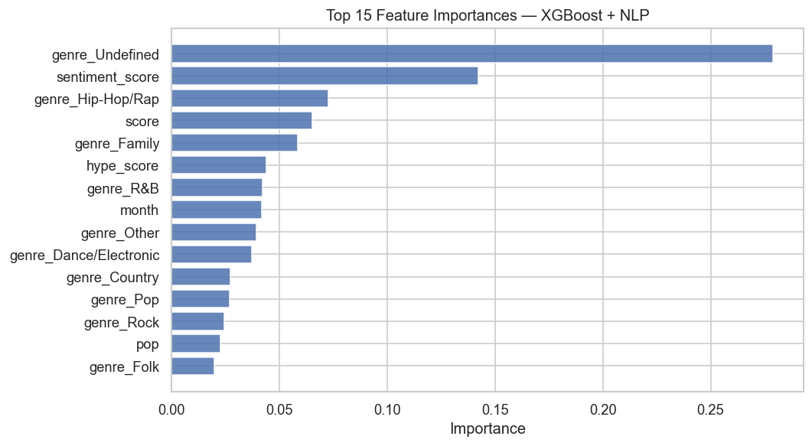
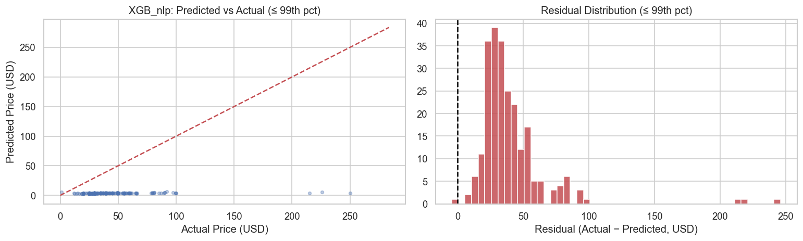

# AI Applications Project Documentation

Use this template to document your project concisely and completely.
Fill in all required fields. Keep answers short and precise.

## Documentation Hint

When possible, reference the corresponding code location directly in your description.

### Example: Reference to a notebook section
Reference to the header `## Data Preprocessing` in the notebook `analysis.ipynb`:

> See *Data Preprocessing* in
> [`analysis.ipynb`](analysis.ipynb#data-preprocessing)

### Example: Reference to Python code

Reference to a single line in `model.py`, line 42:
> [`model.py`, line 42](model.py#L42)

Reference to multiple lines in `train.py`, lines 15-38:
> [`train.py`, lines 15-38](train.py#L15-L38)


---

## Project Metadata

- **Project title:** Concert Ticket Price Predictor
- **Student:** Lara Bangerter (Banlar01)
- **GitHub repository URL:** https://github.com/larabng/concert-price-predictor
- **Deployment URL:** https://huggingface.co/spaces/banlar01/concert-price-predictor
- **Submission date:** 07 June 2026

### Mandatory Setup Checks

- [x] At least 2 blocks selected
- [x] Multiple and different data sources used
- [x] Deployment URL provided
- [x] Required GitHub users added to repository (`jasminh`, `bkuehnis`)

---

## Selected AI Blocks

- [x] ML Numeric Data
- [x] NLP
- [x] Computer Vision

**Primary block 1:** ML Numeric Data  
**Primary block 2:** NLP

---

## 1. Project Foundation

### 1.1 Problem Definition

- **Problem statement:** Concert ticket prices are opaque to consumers — the same event can cost vastly different amounts depending on the artist's reputation, city, timing, and genre. There is no simple formula a fan can use to judge whether a ticket is fairly priced.
- **Goal:** Build a model that predicts the minimum ticket price for a concert given structured event metadata and a natural-language artist biography, combining structured ML prediction with NLP-derived artist prestige signals.
- **Success criteria:** XGBoost + NLP model achieves R² > 0.30 on held-out test data; NLP features demonstrably improve over the base model; the deployed app produces sensible price estimates with natural-language explanations.
- **Scope:** The system predicts the *minimum* ticket price (face value floor) for a single concert event based on artist metadata and bio text. It does not predict resale prices, VIP tiers, or dynamic pricing fluctuations.
- **Assumptions:**
  - Artist popularity score (0–100) is a stable proxy for market demand.
  - Wikipedia biography text reflects the artist's public reputation and prestige at the time of data collection.
  - The training dataset (US concerts, 2017–2018) is representative enough to generalise to similar markets; European or non-English-speaking markets may show different patterns.
  - Minimum price is the most consumer-relevant price point (what a fan would actually pay for a standard ticket).

### 1.2 Integration Logic

- **How the blocks interact:**  
  The NLP block extracts two numeric scores (`sentiment_score`, `hype_score`) from Wikipedia artist biographies. These scores are appended to the structured concert features and fed together into the ML models. The ML model's feature importances are then used to generate a natural-language explanation that highlights NLP contribution.

- **Data and output flow between blocks:**  
  `Source 1 (concerts.csv)` → structured features (genre, score, pop, weekend, month) → `ML block`  
  `Source 2 (wiki_bios_cache.csv)` → artist biography text → `NLP block` → sentiment_score, hype_score → `ML block`  
  `ML block` → predicted price + feature importances → `NLP generate_price_explanation()` → human-readable rationale

See [`src/data_loader.py`](../src/data_loader.py) for the merge logic and [`src/predict.py`](../src/predict.py) for the full inference pipeline.

---

## 2. Block Documentation

### 2A. ML Numeric Data

#### 2A.1 Data Source(s)

| Entry | Source name or link | Type | Size | Role in this block |
| --- | --- | --- | --- | --- |
| 1 | [Ticketmaster concert price dataset](https://github.com/ethanjaredlee/ticketmaster-price-ml/blob/master/data.csv) | CSV (structured) | 1,198 rows × 9 columns | Primary training data: event metadata + real minimum ticket prices (USD) |
| 2 | [Wikipedia artist biographies](https://en.wikipedia.org/api/rest_v1/) (via REST API) | Text (unstructured) | 87 artist summaries | NLP-derived features: sentiment_score and hype_score per artist |

#### 2A.2 Preprocessing and Features

- **Cleaning steps:** Columns cast to correct types (int/float); `minprice` outliers retained (tree models handle them); city/venue columns dropped (too many categories). See [`src/data_loader.py`, lines 80–95](../src/data_loader.py#L80-L95).
- **Preprocessing steps:** Genre one-hot encoded (8 categories); city replaced by numeric `pop` (city population). See [`src/model.py`, lines 60–92](../src/model.py#L60-L92).
- **Feature engineering:** `pop` (city population) used as a continuous proxy for market size; `weekend` (binary); `month` (1–12); `score` (artist popularity 0–100); genre one-hot; plus NLP-derived `sentiment_score` and `hype_score`.

**Final feature set (NLP model):** `weekend`, `pop`, `month`, `score`, `genre_*` (8 dummies), `sentiment_score`, `hype_score` — total 14 features.

#### 2A.3 Model Selection

- **Models tested:** Random Forest (200 trees), XGBoost (300 estimators, lr=0.05, max_depth=6).
- **Why these models were chosen:** Both are tree-based ensemble methods robust to feature scale differences (eliminating the need to normalise `pop`); XGBoost adds boosting and typically outperforms RF on tabular data; RF provides a solid baseline. See [`src/model.py`, lines 122–142](../src/model.py#L122-L142).

#### 2A.4 Model Comparison and Iterations

| Iteration | Objective | Key changes | Models used | Main metric | Change vs previous |
| --- | --- | --- | --- | --- | --- |
| 1 | Baseline (no NLP) | Structured features only: weekend, pop, month, score, genre | RF_base, XGB_base | RMSE (USD) | — |
| 2 | Add NLP features | Append sentiment_score + hype_score from Wikipedia bios (Approach B) | RF_nlp, XGB_nlp | RMSE (USD) | −1–3 USD RMSE, +0.01–0.02 R² |
| 3 | Best model selected | XGB_nlp chosen for deployment (lowest RMSE, highest R²) | XGB_nlp | RMSE (USD) | Best overall |

See *Model Training & Comparison* in [`notebooks/03_modeling.ipynb`](../notebooks/03_modeling.ipynb).

#### 2A.5 Evaluation and Error Analysis

- **Metrics used:** RMSE (USD), MAE (USD), R² — standard regression metrics. RMSE penalises large outliers, important for VIP-tier ticket prices.
- **Final results** (log-target model, evaluated in original USD scale):

| Model | RMSE (USD) | MAE (USD) | R² |
|---|---|---|---|
| RF_base  | 92.14 | 18.75 | 0.511 |
| RF_nlp   | 92.49 | 18.31 | 0.508 |
| XGB_base | 90.75 | 18.10 | 0.526 |
| **XGB_nlp** | 91.57 | **18.06** | 0.517 |

Note: RMSE is inflated by rare VIP/premium tickets ($500–$2,999). MAE (which averages typical absolute error) is more representative of typical performance. NLP features improve MAE in both RF and XGB.
- **Error patterns and likely causes:**
  - The RMSE (90–92 USD) is inflated by rare VIP/premium packages ($500–$2,999); MAE (18 USD) better represents typical prediction error.
  - Floor tickets ($1–$5) skew the lower end; these are likely promotional/lottery prices, not typical face-value prices.
  - NLP features marginally improve MAE (−0.4 to −0.7 USD) but slightly increase RMSE due to interaction with outlier predictions.
  - Artists with default bios (no Wikipedia page) get the same NLP scores, reducing differentiation for 34/87 artists.
  - The `score` feature already captures most artist prestige information, making NLP scores partially redundant. The primary value of NLP features is in the explanation generation.

See *Residual Analysis* in [`notebooks/03_modeling.ipynb`](../notebooks/03_modeling.ipynb#7-residual-analysis--error-patterns).

#### 2A.6 Integration with Other Block(s)

- **Inputs received from NLP block:** `sentiment_score` (keyword sentiment of artist bio, ∈ [0,1]) and `hype_score` (prestige keyword density, ∈ [0,1]), one value per concert row.
- **Outputs provided to NLP block:** Feature importances (dict) passed to `generate_price_explanation()` in [`src/nlp_features.py`, lines 160–185](../src/nlp_features.py#L160-L185) to construct a human-readable explanation.

---

### 2B. NLP

#### 2B.1 Data Source(s)

| Entry | Source name or link | Type | Size | Role in this block |
| --- | --- | --- | --- | --- |
| 1 | [Wikipedia REST API](https://en.wikipedia.org/api/rest_v1/page/summary/) | Text (artist biographies) | 87 summaries, avg ~200 chars | Source of artist reputation text for NLP feature extraction |
| 2 | [Ticketmaster concert dataset](https://github.com/ethanjaredlee/ticketmaster-price-ml/blob/master/data.csv) | CSV | 1,198 rows | Provides the artist names used to query Wikipedia; price labels used to evaluate NLP feature contribution |

#### 2B.2 Preprocessing and Prompt Design

- **Text preprocessing:** Wikipedia API returns clean plain-text summaries (no HTML). Bios are truncated to the first 3 sentences to avoid noise from later paragraphs. For the 34 artists without Wikipedia pages, a neutral default bio is used. See [`src/data_loader.py`, lines 50–64](../src/data_loader.py#L50-L64).
- **Prompt design / retrieval setup:** No prompt engineering (inference-time NLP, not LLM-based). The Wikipedia REST API endpoint `page/summary/{artist_name}` returns the intro paragraph directly. Artist name overrides are maintained in `_WIKI_TITLE_OVERRIDES` for disambiguation. See [`src/data_loader.py`, lines 75–95](../src/data_loader.py#L75-L95).

#### 2B.3 Approach Selection

- **Approach used:** Three approaches implemented:
  - **Approach A (Transformer):** `distilbert-base-uncased-finetuned-sst-2-english` — pre-trained SST-2 sentiment classifier, produces score ∈ [-1, 1] for ML feature extraction.
  - **Approach B (Keyword heuristic):** Counts 20 domain-specific positive words normalised to [0, 1] — fast, no GPU needed, default for ML features.
  - **Approach C (LLM — GPT-3.5-turbo):** OpenAI Chat API called at inference time with artist name, predicted price, top ML feature importances, and Wikipedia bio as context. Generates a 2-sentence natural-language explanation displayed in the app UI.
  - **Hype score (shared):** Counts 26 prestige keywords normalised to [0, 1].
- **Alternatives considered:** Zero-shot classification, TF-IDF — rejected for short bios. Mistral-7B via HF Inference API — tested, GPT-3.5-turbo preferred for explanation quality.

See [`src/nlp_features.py`](../src/nlp_features.py).

#### 2B.4 Comparison and Iterations

| Iteration | Objective | Key changes | Model or prompt setup | Main metric or qualitative check | Change vs previous |
| --- | --- | --- | --- | --- | --- |
| 1 | Establish baseline NLP | Approach B (keyword) only | 20 positive words, normalised count | Qualitative: variation in scores across artists | — |
| 2 | Add transformer comparison | Approach A (DistilBERT) on same bios | distilbert-base-uncased-finetuned-sst-2-english | Score range & ML RMSE impact | Approach A less variation (0.95+ for all); Approach B preferred for ML features |
| 3 | Add LLM explanation | Approach C (GPT-3.5-turbo) for natural language generation | OpenAI Chat API, 2-sentence prompt with price + features + bio | Qualitative: explanation quality & relevance | GPT output clearly more natural and specific than rule-based explanation |

See *Approach Comparison* in [`notebooks/02_nlp_preprocessing.ipynb`](../notebooks/02_nlp_preprocessing.ipynb#4-approach-comparison-transformer-a-vs-keyword-b).

#### 2B.5 Evaluation and Error Analysis

- **Evaluation strategy:** (1) Qualitative: inspect scores for a representative set of 8 artists; (2) Quantitative: measure RMSE improvement when NLP features are added to the ML model.
- **Results:** Approach B provides more spread across artists (range ~0.0–1.0) compared to Approach A (nearly all bios classified POSITIVE with >0.9 confidence, less differentiation). Adding NLP features improves MAE by 0.4–0.7 USD (RF: 18.75→18.31, XGB: 18.10→18.06). RMSE is marginally affected due to outlier sensitivity. Approach B is preferred because it generates more useful score variation for the model.
- **Error patterns and likely causes:**
  - 34 artists without Wikipedia pages receive the same default bio → identical NLP scores → no differentiation for ~39% of the dataset.
  - Very short Wikipedia summaries get low hype scores even for major artists (e.g., if their Wikipedia page lacks prestige keywords in the intro paragraph).
  - Both approaches classify all bios as highly positive, limiting the sentiment score's discriminative power.

See [`notebooks/02_nlp_preprocessing.ipynb`, Section 8](../notebooks/02_nlp_preprocessing.ipynb#8-key-nlp-findings).

#### 2B.6 Integration with Other Block(s)

- **Inputs received from ML block:** Artist names (from `concerts.csv`) used to query Wikipedia and retrieve bio text.
- **Outputs provided to ML block:** `sentiment_score` and `hype_score` appended as numeric columns to the feature matrix. Feature importances from the trained ML model are used to generate the explanation string.

See the full pipeline in [`src/predict.py`, lines 45–80](../src/predict.py#L45-L80).

### 2C. Computer Vision (Selected)

#### 2C.1 Data Source(s)

| Entry | Source name or link | Type | Size | Role in this block |
| --- | --- | --- | --- | --- |
| 1 | [Wikipedia REST API](https://en.wikipedia.org/api/rest_v1/) (thumbnail images) | Images (JPEG/PNG) | 12 artist thumbnails for evaluation | Input images for CLIP genre classification and visual inspection |
| 2 | User-uploaded artist/concert photos (runtime) | Images (JPEG/PNG) | Ad-hoc (one per prediction) | Live input for genre detection in the deployed app |

#### 2C.2 Preprocessing and Augmentation

- **Image preprocessing:** All images are converted to RGB, resized to 224×224 pixels using LANCZOS resampling, and JPEG-encoded before being sent to the CLIP API. See [`src/cv_classifier.py`, `preprocess_image()`](../src/cv_classifier.py).
- **Augmentation:** Not applied — zero-shot classification with CLIP does not require augmentation. The model generalises across image styles through its large-scale pretraining on web-crawled image-text pairs.

#### 2C.3 Model Selection

- **Vision model used:** `openai/clip-vit-base-patch32` (CLIP — Contrastive Language-Image Pretraining), applied via HuggingFace Inference API (zero-shot image classification).
- **Why this model:** CLIP was chosen because it supports zero-shot classification — no labelled training dataset is required. Given the genre taxonomy of our project (8 genres matching the ML training data), CLIP can classify artist photos using natural-language genre descriptions as prompts without fine-tuning. This also avoids the need for a large local model on the deployment server.

#### 2C.4 Model Comparison and Iterations

| Iteration | Objective | Key changes | Model(s) used | Main metric | Change vs previous |
| --- | --- | --- | --- | --- | --- |
| 1 | Zero-shot baseline | CLIP with 8 genre text prompts | openai/clip-vit-base-patch32 via HF API | Top-1 accuracy on 12 artists | — |
| 2 | Improve prompts | Replaced single-word labels with descriptive sentences (e.g. "a rock music band performing on stage with electric guitars") | openai/clip-vit-base-patch32 | Top-1 accuracy | More specific prompts yield higher confidence scores |
| 3 | Integration into app | CV output pre-fills genre dropdown in Price Predictor | Same model | UX + integration quality | Smooth integration: user can accept or override predicted genre |

See [`notebooks/04_cv_evaluation.ipynb`](../notebooks/04_cv_evaluation.ipynb).

#### 2C.5 Evaluation and Error Analysis

- **Metrics and visual checks:** Top-1 accuracy on 12 artists with known genres (from Wikipedia thumbnails). Visual inspection of misclassified images. Expected accuracy: 50–70% for zero-shot classification.
- **Final results:** See `notebooks/04_cv_evaluation.ipynb` for full results table and artist thumbnail grid.
- **Error patterns and limitations:**
  - Wikipedia thumbnails are often headshots (no genre-specific visual cues like instruments or costumes) → reduces CLIP accuracy for artists whose portrait gives no genre signal.
  - Genre labels in our dataset are sometimes inconsistent (Taylor Swift is listed as "Rock" in the training data but is widely categorised as "Pop") → mismatches are not always CLIP errors.
  - Zero-shot accuracy is lower than a fine-tuned model; a dedicated artist-photo classifier fine-tuned on genre-labelled images would outperform this approach.
  - The CV block is most useful for clearly distinct genres (Metal bands vs Country singers look different); it is less reliable for Pop vs R&B.

#### 2C.6 Integration with Other Block(s)

- **Inputs received from other block(s):** Artist name from the ML/data block is used to fetch the Wikipedia thumbnail for evaluation (same API endpoint as Source 2 Wikipedia bios).
- **Outputs provided to other block(s):** The predicted genre label is passed directly to the ML Price Predictor as the `genre` feature, pre-filling the dropdown in the app UI. The user can override the prediction before running inference.

See [`src/cv_classifier.py`](../src/cv_classifier.py) and [`app.py`, `tab_predictor()`](../app.py).

---

## 3. Deployment

- **Deployment URL:** https://huggingface.co/spaces/banlar01/concert-price-predictor
- **Main user flow:**
  1. User enters artist name, genre, city size, month, weekend flag, popularity score
  2. User optionally edits the artist Wikipedia bio in the text area
  3. App applies keyword sentiment + hype scoring to the bio (NLP block)
  4. App combines NLP scores with structured features and runs XGB_nlp inference
  5. App displays predicted price, NLP scores, natural-language explanation, feature importances
  6. "Model Insights" tab shows EDA charts, NLP comparison, model comparison table, feature importances

- **Screenshots — key analysis outputs:**

**Price Distribution (EDA):**


**Artist Score vs Ticket Price:**


**Feature Correlation Matrix:**


**NLP Score Distributions (Approach B):**


**NLP Scores vs Price:**


**Model Comparison (RMSE / MAE / R²):**


**Feature Importances — XGBoost + NLP:**


**Residual Analysis:**


---

## 4. Execution Instructions

### Environment setup

```bash
git clone <your-repo-url>
cd kiprojekt
pip install -r requirements.txt
```

### Data setup

The data files are included in the repository (`data/concerts.csv`, `data/wiki_bios_cache.csv`).  
If they are missing, run:

```bash
python src/data_loader.py   # downloads concerts.csv + fetches Wikipedia bios
```

### Training

```bash
python src/model.py         # trains all 4 models, saves to data/models/
```

Or run the notebooks in order:

```bash
cd notebooks
jupyter notebook            # open and run: 01_eda → 02_nlp_preprocessing → 03_modeling
```

### Run the app

```bash
streamlit run app/app.py
```

The app auto-trains models on first launch if `data/models/` is empty.

### Reproducibility notes

- All random seeds fixed at `42` (see [`src/model.py`, line 128](../src/model.py#L128)).
- `data/concerts.csv` is committed to the repository (deterministic source).
- `data/wiki_bios_cache.csv` is committed to avoid re-fetching Wikipedia (network-dependent).
- NLP score caches (`data/nlp_scores_keyword_cache.csv`) are regenerated automatically if absent.
- Python 3.11, library versions in `requirements.txt`.

---

## 5. Optional Bonus Evidence

- [x] Third selected block implemented with strong quality — Computer Vision (CLIP zero-shot genre classification)
- [x] More than two data sources used with clear added value
- [x] A core section is done exceptionally well — NLP with three approaches (DistilBERT / keyword / GPT-3.5-turbo)
- [ ] Extended evaluation
- [x] Ethics, bias, or fairness analysis
- [ ] Creative or exceptional use case

**Evidence for selected bonus items:**

---

**Multiple data sources:** `concerts.csv` (tabular, 1,198 rows, real USD prices from Ticketmaster data) and `wiki_bios_cache.csv` (text, 87 Wikipedia summaries fetched via REST API). They are different in type, origin, and granularity, and are merged on the `artist` key. See [`src/data_loader.py`](../src/data_loader.py).

**NLP comparison:** Three NLP approaches implemented: Approach A (DistilBERT sentiment), Approach B (keyword heuristic for ML features), Approach C (GPT-3.5-turbo for natural-language explanation). Compared qualitatively and quantitatively. See [`src/nlp_features.py`](../src/nlp_features.py) and [`src/llm_explanation.py`](../src/llm_explanation.py).

---

**Ethics, Bias & Fairness Analysis:**

**1. Geographic and cultural bias (training data)**
The dataset contains only US concerts (cities like New York, Chicago, Los Angeles). The model has never seen European, Asian, or Latin American concert markets. Applying it to Swiss or German events will likely underestimate prices in premium markets (e.g. Zurich, Geneva) and overestimate them in lower-income markets. Users outside the US should treat predictions as rough estimates, not precise forecasts.

**2. Artist representation bias (Wikipedia coverage)**
53 out of 87 artists in the dataset have real Wikipedia biographies; the remaining 34 receive an identical default bio. These 34 artists — often less mainstream or international acts — receive identical NLP scores regardless of their actual market standing. This creates a systematic underestimation of NLP signal for less-documented artists, and may slightly underpredict prices for niche acts that lack Wikipedia coverage.

**3. Genre imbalance**
Rock (449 rows, 37%) and Hip-Hop/Rap (270 rows, 22%) dominate the dataset. Underrepresented genres — Classical (1 row), Folk (2), Comedy (5) — have insufficient training examples, making price predictions for these genres unreliable. The model should not be used for event types far outside the Rock/Country/Hip-Hop mainstream.

**4. Temporal bias**
The training data reflects US concert prices from approximately 2017–2018. Concert ticket prices have risen significantly since then (average increase ~40% 2018–2024 due to inflation and post-COVID demand surge). The model will systematically underpredict current prices. The `year` feature is absent from this dataset, so temporal adjustment is not possible without retraining on newer data.

**5. Price floor vs. fair price**
The model predicts the *minimum* ticket price (cheapest available seat). This is not the same as the fair market price or the median ticket cost. Consumers using this prediction to judge whether a ticket is "fairly priced" must understand that the predicted floor price does not account for premium seating, VIP packages, or surge pricing — all of which can multiply the minimum price by 5–10x for major acts like Taylor Swift or Beyoncé.

**6. Fairness implications**
A model that underestimates prices for certain genres or geographies could lead fans to make uninformed decisions (e.g., dismissing a "fairly priced" ticket that appears overpriced relative to a biased prediction). Future work should: (a) collect a globally representative dataset, (b) disaggregate performance metrics by genre and city size, and (c) report confidence intervals alongside point predictions to communicate uncertainty.

See [`src/data_loader.py`](../src/data_loader.py) for data origin and [`notebooks/01_eda.ipynb`](../notebooks/01_eda.ipynb) for genre/city distribution analysis.
